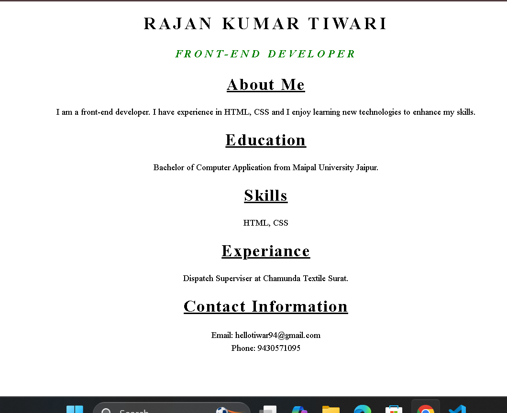

# 🌐 Personal Portfolio Website

This is a simple and responsive **Personal Portfolio Website** built using **HTML** and **CSS**. It showcases my profile, education, skills, work experience, and contact information in a clean and organized layout.

## 📸 Screenshot

<p align="center">
  
</p>

## 📌 Features

- Responsive and simple design
- About Me section
- Education details
- Skills section
- Experience section
- Contact Information
- Clean and easy-to-read layout

## 🛠️ Technologies Used

- HTML5
- CSS3

## 📖 About Me

I am a Front-End Developer with knowledge of HTML and CSS. I enjoy learning new technologies and improving my web development skills by building simple and responsive websites.

## 🎓 Education

**Bachelor of Computer Applications (BCA)**  
Maipal University, Jaipur

## 💻 Skills

- HTML5
- CSS3

## 💼 Experience

**Dispatch Supervisor**  
Chamunda Textile, Surat

## 📂 Project Structure

```text
portfolio/
│── index.html
│── style.css
│── README.md
└── output/
    └── output.png
```

## 🚀 How to Run the Project

1. Clone this repository:
   ```bash
   git clone https://github.com/rajan9430/HTML
   ```
2. Go to the labwork project file.
3. Open the css folder.
4. Double-click **index.html** or open it in your browser.

## 📞 Contact

- **Email:** hellotiwar94@gmail.com
- **Phone:** +91 9430571095

## 📄 License

This project is created for learning and personal portfolio purposes.