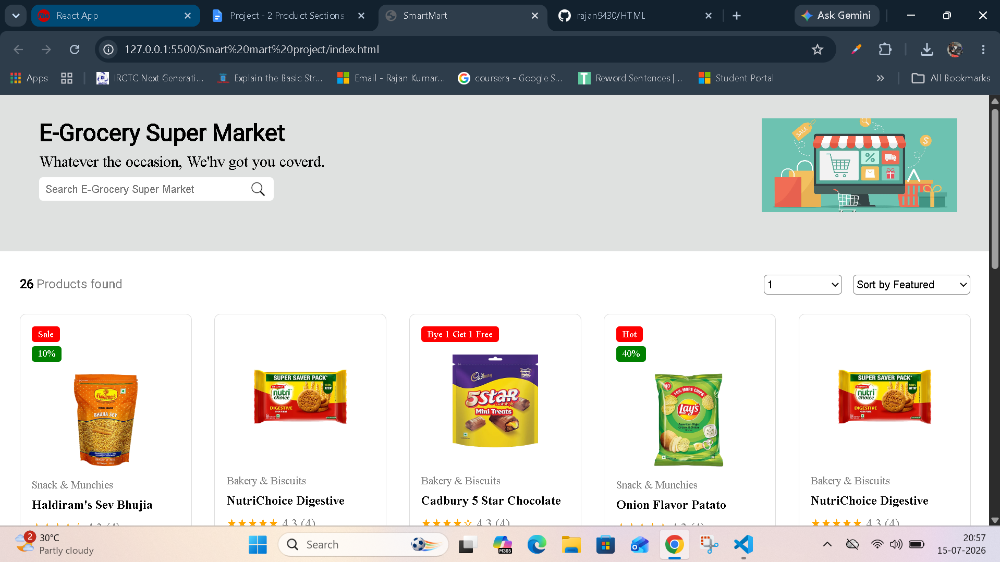
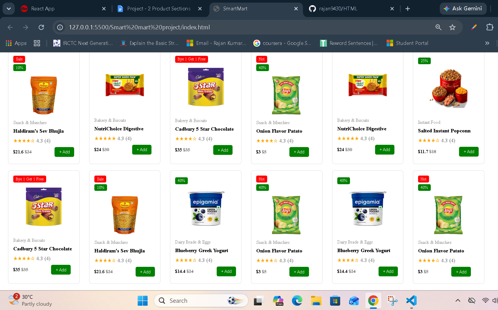
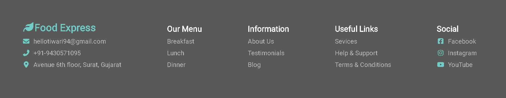

# 🛒 SmartMart - E-Grocery Super Market

A modern **E-Grocery Super Market** webpage built using **HTML5** and **CSS3**. The project displays grocery products in a clean card layout with product badges, ratings, prices, search functionality, sorting options, and a professional footer.

---

## 📌 Project Overview

SmartMart is a static grocery shopping webpage that provides an attractive product listing interface. It is designed to practice HTML structure and CSS styling without using any frameworks or JavaScript.

---

## ✨ Features

* Responsive header section
* Grocery store banner
* Product search box
* Product count display
* Sort products dropdown
* Product cards with:

  * Product image
  * Category
  * Product name
  * Star rating
  * Price and discount
  * Sale / Hot / Discount badges
  * Add to Cart button
* Professional footer with:

  * Contact information
  * Our Menu links
  * Information section
  * Useful Links
  * Social Media links
* Clean and simple UI
* Built using only HTML and CSS

---

## 🛠 Technologies Used

* HTML5
* CSS3
* Google Fonts
* Font Awesome (Icons)

---

## 📁 Project Structure

```text
SmartMart/
│
├── index.html
├── README.md
│
├── css/
│   └── style.css
│
├── images/
│   ├── head-image2.png
│   ├── search.png
│   ├── haldirams-bhujia-sev.webp
│   ├── nutri.webp
│   ├── choclate.webp
│   ├── lays.webp
│   ├── popconn.png
│   └── greek.webp
│
├── icons/
│   └── webfonts/
│
├── google-font/
│   └── stylesheet.css
│
└── output/
    ├── output1.png
    ├── output2.png
    └── output3.png
```

---

## 📷 Screenshots

### Header



### Product Cards



### Footer



---

## 🦶 Footer Section

The website includes a professional footer with the following sections:

* 📧 Contact Email
* 📞 Phone Number
* 📍 Office Address
* 🍽️ Our Menu
* ℹ️ Information
* 🔗 Useful Links
* 🌐 Social Media Links
* 🎨 Font Awesome Icons

---

## 🚀 How to Run

1. Download or clone the repository.

```bash
git clone https://github.com/rajan9430/HTML.git
```

2. Open the project folder.

3. Double-click **index.html** or open it in your preferred web browser.

---

## 📚 Learning Objectives

This project helped practice:

* HTML page structure
* CSS selectors
* Card layout design
* Inline-block layout
* Background images
* Product badges
* Search form
* Buttons
* Footer design
* Font Awesome icons
* Spacing and alignment
* Responsive webpage structure

---

## 👨‍💻 Author

**Rajan Tiwari**

---

## 📄 License

This project is created for learning and educational purposes.
