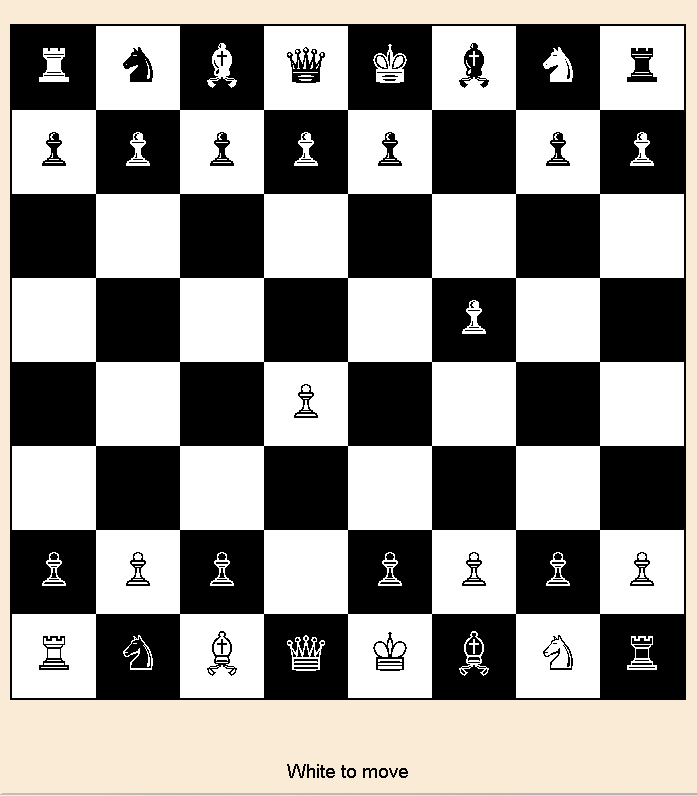

# ♟️ Interactive Chessboard

An interactive Chessboard built using **HTML, CSS, and JavaScript**. This project allows players to move chess pieces according to basic chess rules, highlights valid moves, captures opponent pieces, detects the winner when a king is captured, and displays a modern victory popup with celebration effects.

---

## 📌 Features

- 🎯 Interactive chessboard
- ♙ Basic chess movement rules
- ♜ Legal move highlighting
- 🔴 Capture move highlighting
- 👆 Piece selection
- 🔄 Turn-based gameplay (White & Black)
- 👑 King capture detection
- 🏆 Winner popup modal
- 🎉 Confetti celebration animation
- 🔁 Play Again button
- 💻 Responsive and clean UI

---

## 🛠️ Technologies Used

- HTML5
- CSS3
- JavaScript (Vanilla JS)
- Google Fonts (Outfit)

---

## 📂 Project Structure

```
Chessboard/
│
├── index.html
├── css/
│   └── style.css
├── js/
│   └── script.js
└── README.md
```

---

## 🚀 How to Run

1. Download or clone this repository.

```bash
git clone https://github.com/your-username/chessboard.git
```

2. Open the project folder.

3. Run **index.html** in your browser.

No installation or additional libraries are required.

---

## 🎮 Game Rules

- White always plays first.
- Click on your own piece to select it.
- Green squares indicate legal moves.
- Red squares indicate capture moves.
- Click a highlighted square to move the piece.
- Turns alternate between White and Black.
- Capturing the opponent's King ends the game.
- A victory popup appears with a celebration animation.
- Click **Play Again** to restart the game.

---

## ✨ Highlights

- Smooth UI animations
- Winner celebration modal
- Confetti effect
- Simple and readable JavaScript
- Responsive design
- Clean project structure

---

## 📸 Screenshot

Add your project screenshot here.

```
images/screenshot.png
```

Example:

```md

```

---

## 🔮 Future Improvements

- Castling
- En Passant
- Pawn Promotion
- Check Detection
- Checkmate Detection
- Draw Detection
- Move History
- Undo Move
- Timer
- Sound Effects
- AI Opponent
- Online Multiplayer

---

## 👨‍💻 Author

**Rajan Tiwari**

---

## 📜 License

This project is open source and available under the MIT License.

---

## Hosted Link: chassboard.vercel.app

### ⭐ If you like this project, don't forget to give it a Star on GitHub!