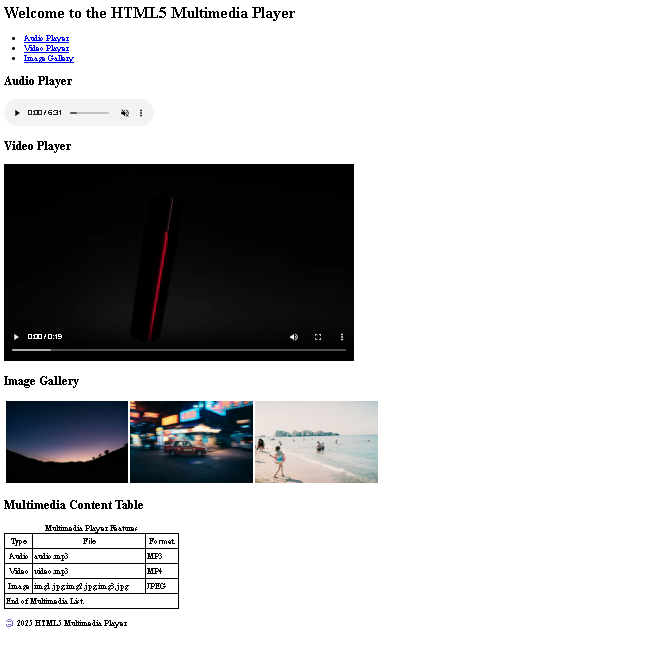

# 🎵 HTML5 Multimedia Player

A simple multimedia web page built using **HTML5**. This project demonstrates how to use HTML5 multimedia elements such as **audio**, **video**, and **images**, along with semantic HTML tags and tables.

## 📌 Project Overview

The HTML5 Multimedia Player is a beginner-friendly project created using only HTML. It provides a clean interface to display multimedia content, including an audio player, video player, and image gallery.

This project is ideal for students and beginners who want to learn HTML5 multimedia tags and semantic webpage structure without using CSS or JavaScript.

---

## ✨ Features

- 🎵 HTML5 Audio Player
- 🎥 HTML5 Video Player
- 🖼️ Image Gallery
- 📋 Multimedia Information Table
- 🧭 Navigation Menu
- 🏗️ Semantic HTML5 Elements
- 📱 Simple and Easy-to-Understand Layout

---

## 🛠️ Technologies Used

- HTML5

---

## 📂 Project Structure

```
HTML5-Multimedia-Player/
│
├── index.html
├── audio/
│   └── Deewane.mp3
├── video/
│   └── udariya.mp4
├── img/
│   ├── img1.jpg
│   ├── img2.jpg
│   └── img3.jpg
└── README.md
```

---

## 📸 Project Sections

### 🏠 Header
- Website title
- Navigation menu

### 🎵 Audio Player
- Play, pause, mute, and loop audio using the HTML5 `<audio>` element.

### 🎥 Video Player
- Watch videos using the HTML5 `<video>` element with playback controls.

### 🖼️ Image Gallery
- Displays multiple images in a table layout.

### 📋 Multimedia Content Table
Shows multimedia file information such as:

| Type | File | Format |
|------|------|--------|
| Audio | audio.mp3 | MP3 |
| Video | video.mp4 | MP4 |
| Image | img1.jpg, img2.jpg, img3.jpg | JPEG |

### © Footer
Displays the copyright information.

---

## 🎯 Learning Objectives

This project helps you learn:

- HTML5 Semantic Elements
- Header and Navigation
- Audio Tag (`<audio>`)
- Video Tag (`<video>`)
- Image Tag (``)
- Tables in HTML
- Basic Page Structure
- Organizing Multimedia Files

---

## ▶️ How to Run

1. Download or clone this repository.
2. Click on the labwork project folder.
3. Than go to the labwork 3.1.
4. Keep all multimedia files in their respective folders:
   - `audio/`
   - `video/`
   - `img/`
5. Open `index.html` in any modern web browser.
6. Enjoy the multimedia player.

---

## 🚀 Future Improvements

- Add CSS styling
- Make the page fully responsive
- Add JavaScript media controls
- Include more multimedia content
- Improve image gallery design

---

## Project Screenshort



## 👨‍💻 Author

**Rajan Kumar Tiwari**

---

## 📄 License

This project is created for educational and learning purposes.