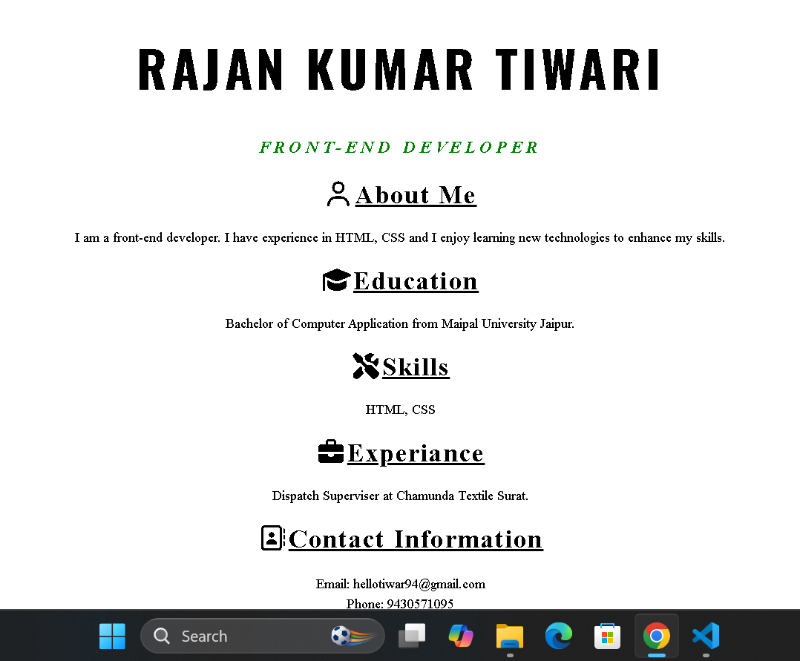

# 💼 Personal Portfolio Website

This is my personal portfolio website built using **HTML** and **CSS**. It showcases my profile, education, skills, work experience, and contact information in a clean and responsive layout.

## 🌐 Live Preview

You can host this project using GitHub Pages, Netlify, or Vercel.

---

## 📌 Features

- Clean and simple user interface
- Responsive design
- About Me section
- Education details
- Skills section
- Experience section
- Contact information
- Font Awesome icons

---

## 🛠️ Technologies Used

- HTML5
- CSS3
- Font Awesome

---

## 👨‍💻 About Me

Hi, I'm **Rajan Kumar Tiwari**, an aspiring Front-End Developer. I enjoy creating clean and user-friendly web pages using HTML and CSS. I am passionate about learning new technologies and continuously improving my web development skills.

---

## 🎓 Education

**Bachelor of Computer Applications (BCA)**  
Manipal University Jaipur

---

## 💡 Skills

- HTML5
- CSS3

---

## 💼 Experience

**Dispatch Supervisor**  
Chamunda Textile, Surat

---

## 📞 Contact

**Name:** Rajan Kumar Tiwari

**Email:** hellotiwar94@gmail.com

**Phone:** +91 9430571095

---

## 📂 Project Structure

```
portfolio/
│── index.html
│── style.css
│── images/
│── README.md
```

---

## 🚀 Future Improvements

- Add JavaScript animations
- Dark mode
- Projects section
- Resume download button
- Social media links
- Contact form
- Responsive navigation bar

---

## 📸 Screenshot

<p align="center">
  
</p>

## 📄 License

This project is open-source and available under the MIT License.

---

### ⭐ If you like this project, please give it a Star on GitHub!