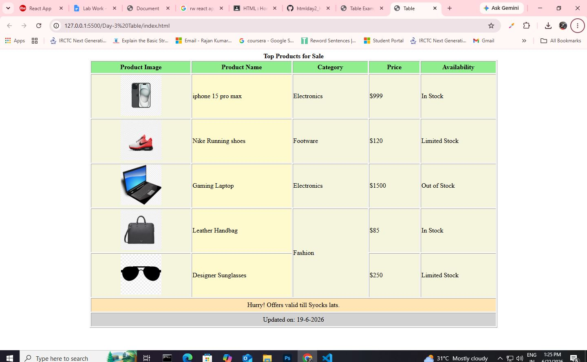

# 🛍️ HTML Product Catalog Table

A simple product catalog webpage created using **HTML5**. This project demonstrates how to create a structured product table with images, categories, prices, stock availability, and table formatting using only HTML.

## 📌 Project Overview

The HTML Product Catalog Table is a beginner-friendly project that showcases different products in a well-organized table layout. It uses HTML table elements along with images, colors, captions, and semantic structure to display product information clearly.

This project is designed for students and beginners who are learning HTML tables and webpage layout without using CSS or JavaScript.

---

## ✨ Features

- 🛍️ Product Catalog Table
- 🖼️ Product Images
- 📦 Product Categories
- 💲 Product Prices
- ✅ Stock Availability Status
- 🎨 Colored Table Cells using HTML Attributes
- 📑 Table Caption, Header, Body, and Footer
- 🔗 Demonstrates `rowspan` and `colspan`

---

## 🛠️ Technologies Used

- HTML5

---

## 📂 Project Structure

```
HTML-Product-Catalog/
│
├── index.html
├── img/
│   ├── hdiphone 15pro max.png
│   ├── nike shoes.png
│   ├── laptop.png
│   ├── hand bag.png
│   └── sunglasses.png
└── README.md
```

---

## 📋 Products Included

| Product | Category | Price | Availability |
|----------|----------|------:|--------------|
| iPhone 15 Pro Max | Electronics | $999 | In Stock |
| Nike Running Shoes | Footwear | $120 | Limited Stock |
| Gaming Laptop | Electronics | $1500 | Out of Stock |
| Leather Handbag | Fashion | $85 | In Stock |
| Designer Sunglasses | Fashion | $250 | Limited Stock |

---

## 📚 HTML Concepts Used

- HTML Tables (`<table>`)
- Table Caption (`<caption>`)
- Table Header (`<thead>`)
- Table Body (`<tbody>`)
- Table Footer (`<tfoot>`)
- Table Rows (`<tr>`)
- Table Cells (`<td>`)
- Table Headings (`<th>`)
- Images (``)
- `rowspan`
- `colspan`
- Background Colors (`bgcolor`)
- Text Alignment (`align`)
- Width and Height Attributes

---

## 🎯 Learning Objectives

This project helps you learn:

- Creating tables in HTML
- Displaying images inside tables
- Organizing product information
- Using `rowspan` and `colspan`
- Structuring table sections with `thead`, `tbody`, and `tfoot`
- Applying basic formatting using HTML attributes

---

## ▶️ How to Run

1. Download or clone this repository.
2. Make sure all product images are placed inside the **img** folder.
3. Open **index.html** in any modern web browser.
4. View the product catalog table.

---

## 🚀 Future Improvements

- Add CSS for a modern and responsive design.
- Include product descriptions.
- Add product ratings and reviews.
- Create product detail pages.
- Add search and filter functionality using JavaScript.
- Connect the project to a database for dynamic products.

---

## Project Screenshort



## 👨‍💻 Author

**Rajan Kumar Tiwari**

---

## 📄 License

This project is created for educational and learning purposes.