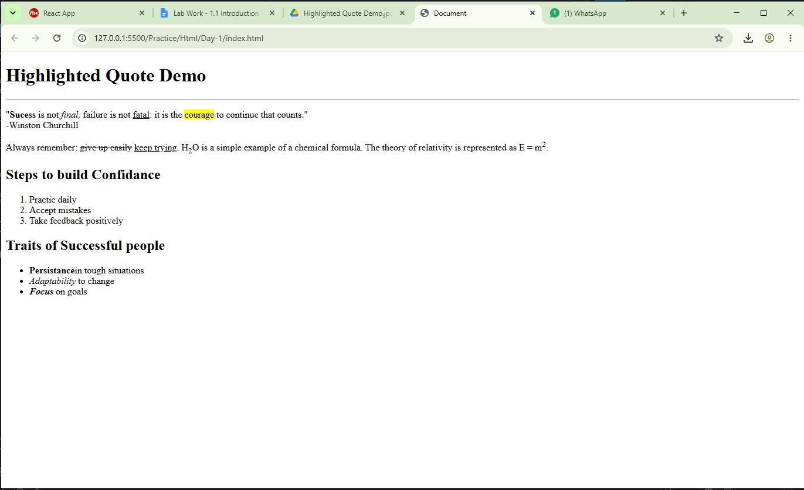

# ✨ Highlighted Quote Demo

A simple **HTML5 webpage** that demonstrates the use of various **text formatting tags**, **ordered lists**, and **unordered lists**. This project is designed for beginners who want to learn how different HTML elements can be used to format and organize content.

---

## 📌 Project Overview

The **Highlighted Quote Demo** is a beginner-friendly HTML project that presents an inspirational quote using different text formatting elements. It also includes examples of chemical formulas, mathematical expressions, and lists to demonstrate essential HTML tags.

This project is ideal for students learning the basics of HTML without using CSS or JavaScript.

---

## ✨ Features

- 📝 Inspirational Quote Display
- **Bold** Text Formatting
- *Italic* Text Formatting
- Underlined Text
- Highlighted Text (`<mark>`)
- Deleted and Inserted Text
- Subscript and Superscript Examples
- Numbered List (Ordered List)
- Bullet List (Unordered List)
- Simple and Clean HTML Structure

---

## 🛠️ Technologies Used

- HTML5

---

## 📂 Project Structure

```
Highlighted-Quote-Demo/
│
├── index.html
└── README.md
```

---

## 📄 Project Sections

### 📖 Inspirational Quote
Displays a motivational quote by **Winston Churchill** using multiple HTML formatting tags such as:

- `<strong>`
- `<em>`
- `<u>`
- `<mark>`

---

### 🧪 Text Formatting Examples

Demonstrates:

- Deleted text (`<del>`)
- Inserted text (`<ins>`)
- Subscript (`<sub>`)
- Superscript (`<sup>`)

Examples include:

- H₂O
- E = mc²

---

### 📋 Steps to Build Confidence

An ordered list containing:

1. Practice daily
2. Accept mistakes
3. Take feedback positively

---

### ⭐ Traits of Successful People

An unordered list including:

- Persistence in tough situations
- Adaptability to change
- Focus on goals

---

## 📚 HTML Concepts Used

- HTML Headings
- Paragraphs
- Horizontal Rule (`<hr>`)
- Bold (`<strong>`, `<b>`)
- Italic (`<em>`, `<i>`)
- Underline (`<u>`)
- Highlight (`<mark>`)
- Deleted Text (`<del>`)
- Inserted Text (`<ins>`)
- Subscript (`<sub>`)
- Superscript (`<sup>`)
- Ordered List (`<ol>`)
- Unordered List (`<ul>`)
- List Items (`<li>`)

---

## 🎯 Learning Objectives

This project helps you learn:

- HTML text formatting tags
- Creating ordered and unordered lists
- Displaying scientific and mathematical notations
- Structuring webpage content
- Writing clean and readable HTML code

---

## ▶️ How to Run

1. Download or clone this repository.
2. Open **index.html** in any modern web browser.
3. Explore the formatted quote and HTML examples.

---

## 🚀 Future Improvements

- Add CSS styling for a modern appearance.
- Improve typography and spacing.
- Add icons and illustrations.
- Include more inspirational quotes.
- Make the page responsive.

---

## Project Screenshort



## 👨‍💻 Author

**Rajan Kumar Tiwari**

---

## 📄 License

This project is created for educational and learning purposes.