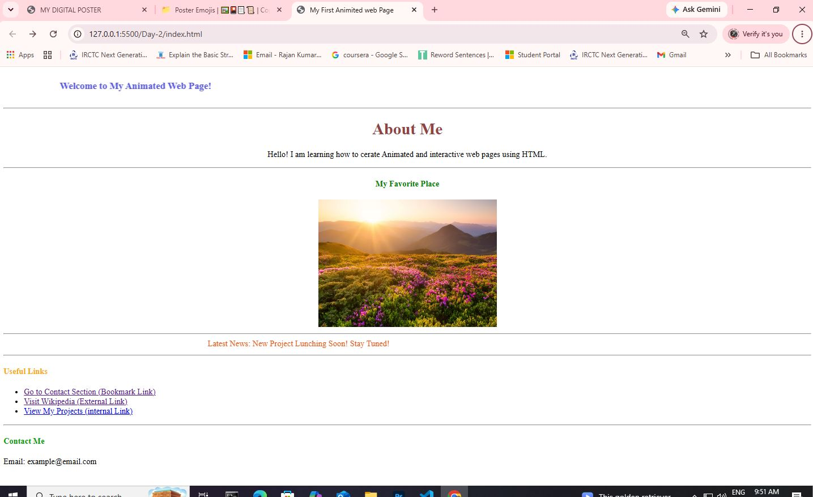

# 🌐 My First Animated Web Page

A simple **Animated Web Page** created using **HTML5**. This beginner-friendly project demonstrates the use of basic HTML elements such as headings, images, hyperlinks, marquees, horizontal lines, and text formatting to create an attractive webpage.

The project is designed for students who are learning HTML and want to understand how to build interactive-looking webpages without using CSS or JavaScript.

---

## 📌 Project Overview

**My First Animated Web Page** is a static HTML webpage that introduces the author, displays a favorite place, shows scrolling announcements, and provides useful navigation links.

This project focuses on learning HTML page structure and commonly used HTML elements.

---

## ✨ Features

- 🎉 Animated Welcome Banner using `<marquee>`
- 👤 About Me Section
- 🖼️ Favorite Place Image
- 📰 Scrolling News Banner
- 🔗 Internal and External Hyperlinks
- 📋 Navigation List
- 📧 Contact Information
- 📄 Clean and Simple HTML Layout

---

## 🛠️ Technologies Used

- HTML5

---

## 📂 Project Structure

```
My-First-Animated-Web-Page/
│
├── index.html
├── img/
│   └── Nature-Positive.webp
└── README.md
```

---

## 📄 Project Sections

### 🎉 Welcome Banner
- Displays an animated welcome message using the `<marquee>` element.

### 👤 About Me
- Introduces the author with a short description.

### 🌿 My Favorite Place
- Displays an image of a beautiful natural location.

### 📰 Latest News
- Shows a scrolling announcement:
  - **"Latest News: New Project Launching Soon! Stay Tuned!"**

### 🔗 Useful Links
Includes:
- Bookmark Link
- External Link (Wikipedia)
- Internal Project Link

### 📧 Contact Me
- Displays a sample email address.

---

## 📚 HTML Concepts Used

- HTML Document Structure
- Headings (`<h1>` to `<h4>`)
- Paragraphs (`<p>`)
- Images (``)
- Hyperlinks (`<a>`)
- Unordered Lists (`<ul>`, `<li>`)
- Horizontal Rules (`<hr>`)
- Font Tag (`<font>`)
- Marquee (`<marquee>`)
- Relative and External Links

---

## 🎯 Learning Objectives

This project helps you learn:

- Creating a basic HTML webpage
- Displaying images
- Working with hyperlinks
- Creating scrolling text using `<marquee>`
- Organizing webpage content
- Understanding HTML page structure

---

## ▶️ How to Run

1. Download or clone this repository.
2. Ensure the image is stored inside the **img** folder.
3. Open **index.html** in any modern web browser.
4. Explore the animated webpage.

---

## 🚀 Future Improvements

- Replace deprecated `<font>` and `<marquee>` tags with CSS.
- Add responsive design using CSS.
- Include CSS animations.
- Improve typography and layout.
- Add JavaScript for better interactivity.
- Create a proper contact form.

---

## Project Screenshort



## 👨‍💻 Author

**Rajan Kumar Tiwari**

---

## 📄 License

This project is created for educational and learning purposes.