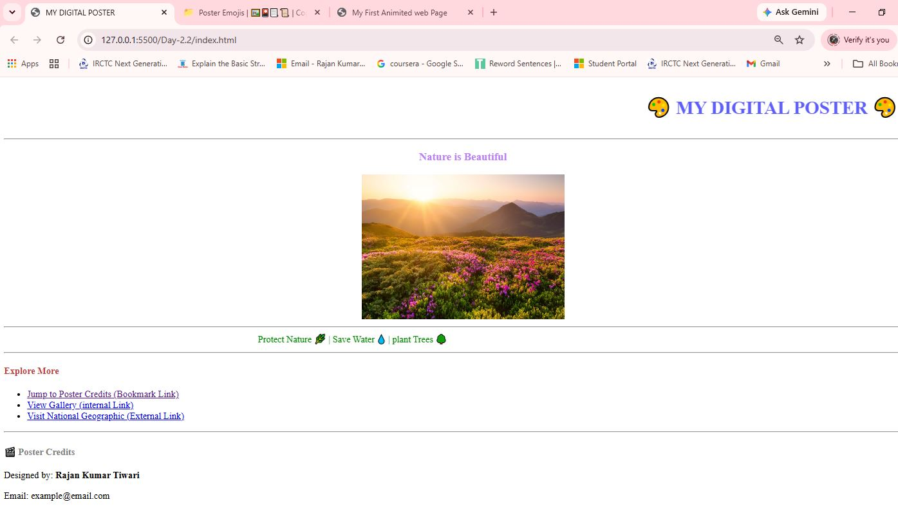

# 🎨 My Digital Poster

A simple **Digital Poster** created using **HTML5**. This project demonstrates the use of basic HTML elements such as headings, images, hyperlinks, marquees, horizontal lines, lists, and text formatting to create an attractive nature-themed poster.

The project is designed for beginners who are learning HTML and want to practice webpage design without using CSS or JavaScript.

---

## 📌 Project Overview

**My Digital Poster** is a static HTML webpage that promotes environmental awareness with the theme **"Nature is Beautiful."** It features a nature image, scrolling messages, useful links, and poster credits.

This project helps learners understand how to combine different HTML elements to create a simple and visually appealing webpage.

---

## ✨ Features

- 🎨 Attractive Digital Poster Layout
- 🌿 Nature-Themed Design
- 🖼️ Online Nature Image
- 📢 Scrolling Text using `<marquee>`
- 🔗 Internal and External Hyperlinks
- 📋 Unordered List for Navigation
- 📄 Poster Credits Section
- 📌 Horizontal Line Separators
- 📝 Text Formatting with Headings and Paragraphs

---

## 🛠️ Technologies Used

- HTML5

---

## 📂 Project Structure

```
My-Digital-Poster/
│
├── index.html
└── README.md
```

---

## 📄 Project Sections

### 🎨 Header
- Animated title using the `<marquee>` element.
- Main heading: **My Digital Poster**.

### 🌿 Nature Section
- Displays the theme **"Nature is Beautiful."**
- Shows an online nature image.

### 📢 Awareness Message
- Scrolling environmental message:
  - Protect Nature 🌿
  - Save Water 💧
  - Plant Trees 🌳

### 🔗 Explore More
Includes different types of links:
- Bookmark Link
- Internal Link
- External Link (National Geographic)

### 👨‍💻 Poster Credits
Displays:
- Designer Name
- Email Address

---

## 📚 HTML Concepts Used

- HTML Document Structure
- Headings (`<h1>` to `<h4>`)
- Paragraphs (`<p>`)
- Images (``)
- Hyperlinks (`<a>`)
- Unordered Lists (`<ul>`, `<li>`)
- Horizontal Rules (`<hr>`)
- Text Formatting (`<strong>`)
- Font Tag (`<font>`)
- Marquee (`<marquee>`)
- External Image URLs

---

## 🎯 Learning Objectives

This project helps you learn:

- Creating a simple webpage with HTML
- Displaying images from the internet
- Working with internal and external links
- Using text formatting elements
- Organizing webpage content
- Building a themed digital poster

---

## ▶️ How to Run

1. Download or clone this repository.
2. Open **index.html** in any modern web browser.
3. Explore the digital poster and its links.

---

## 🚀 Future Improvements

- Replace deprecated tags (`<font>` and `<marquee>`) with CSS.
- Add responsive styling using CSS.
- Include animations with CSS.
- Add more nature images and sections.
- Improve accessibility and navigation.

---

## Project Screenshort



## 👨‍💻 Author

**Rajan Kumar Tiwari**

---

## 📄 License

This project is created for educational and learning purposes.