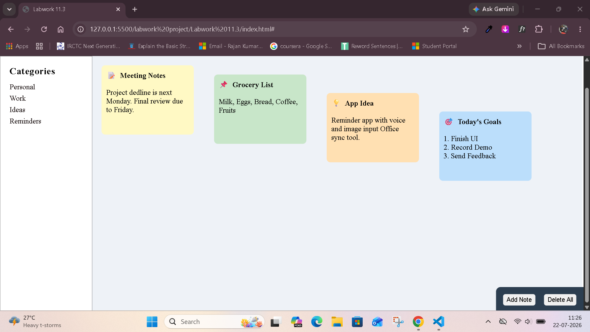

# 📝 Sticky Notes Dashboard

A simple **Sticky Notes Dashboard** built using **HTML5** and **CSS3**. This project demonstrates the use of basic webpage layout techniques such as headers, side navigation, note cards, and fixed-position action buttons.

## 📌 Features

- Responsive page structure using HTML and CSS
- Header with dashboard title
- Sidebar containing note categories
- Sticky note cards with different background colors
- Fixed action buttons:
  - Add Note
  - Delete All
- Simple and clean UI

## 🛠️ Technologies Used

- HTML5
- CSS3

## 📂 Project Structure

```
project-folder/
│
├── index.html
├── css/
│   └── style.css
└── README.md
```

## 🎨 Layout Overview

### Header
- Displays the title **"Sticky Notes Dashboard"**
- Dark blue background

### Sidebar
Contains note categories:
- Personal
- Work
- Ideas
- Reminders

### Main Content
Displays four sticky notes:

1. 📝 Meeting Notes
2. 📌 Grocery List
3. 💡 App Idea
4. 🎯 Today's Goals

Each note has:
- Different background color
- Rounded corners
- Simple card layout

### Action Buttons
Fixed at the bottom-right area:
- **Add Note**
- **Delete All**

> Currently these buttons are for UI purposes only and do not perform any JavaScript actions.

## 🚀 How to Run

1. Download or clone the repository.
2. Open the project folder.
3. Open `index.html` in any modern web browser.

No installation is required.

## 📷 Preview

The dashboard includes:
- A top navigation header
- A left sidebar for categories
- Colorful sticky notes in the main section
- Floating action buttons

## 🔮 Future Improvements

- Add JavaScript functionality
- Create new notes dynamically
- Delete all notes
- Edit existing notes
- Save notes using Local Storage
- Improve responsiveness for mobile devices


## Screenshort




## 👨‍💻 Author

Created as a practice project for learning HTML and CSS.