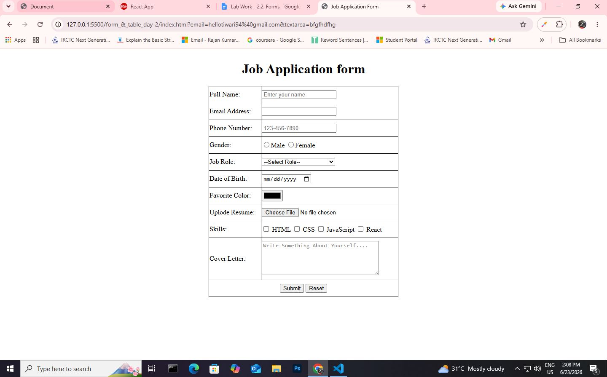

# 💼 HTML Job Application Form

A simple **Job Application Form** built using **HTML5**. This project demonstrates how to create an online job application form using various HTML form elements such as text fields, radio buttons, checkboxes, dropdown menus, file upload, date picker, color picker, and text areas.

This project is ideal for beginners who want to learn HTML forms without using CSS or JavaScript.

---

## 📌 Project Overview

The **HTML Job Application Form** allows users to enter their personal details, choose a job role, upload a resume, select their skills, and submit a cover letter through a structured HTML form.

The project focuses on understanding HTML form controls and table-based form layout.

---

## ✨ Features

- 👤 Full Name Input
- 📧 Email Address Field
- 📱 Phone Number Input
- 🚻 Gender Selection (Radio Buttons)
- 💼 Job Role Dropdown
- 📅 Date of Birth Picker
- 🎨 Favorite Color Picker
- 📄 Resume Upload
- ✅ Skills Selection (Checkboxes)
- 📝 Cover Letter Text Area
- ✔️ Submit and Reset Buttons
- 📋 Table-Based Form Layout

---

## 🛠️ Technologies Used

- HTML5

---

## 📂 Project Structure

```
Job-Application-Form/
│
├── index.html
└── README.md
```

---

## 📑 Form Fields

| Field | Input Type |
|--------|------------|
| Full Name | Text |
| Email Address | Email |
| Phone Number | Number |
| Gender | Radio Button |
| Job Role | Dropdown (Select) |
| Date of Birth | Date |
| Favorite Color | Color Picker |
| Resume | File Upload |
| Skills | Checkboxes |
| Cover Letter | Textarea |
| Submit | Button |
| Reset | Button |

---

## 📚 HTML Concepts Used

- HTML Forms (`<form>`)
- Input Elements (`<input>`)
- Text Input
- Email Input
- Number Input
- Radio Buttons
- Checkboxes
- Select and Option
- Date Input
- Color Picker
- File Upload
- Textarea
- Buttons
- HTML Tables
- Table Rows and Cells
- Required Form Validation

---

## 🎯 Learning Objectives

This project helps you learn:

- Creating HTML forms
- Collecting user information
- Using different input types
- Building forms with tables
- Applying HTML5 validation using the `required` attribute
- Organizing form elements effectively

---

## ▶️ How to Run

1. Download or clone this repository.
2. Open **index.html** in any modern web browser.
3. Fill out the application form.
4. Click **Submit** or **Reset** to test the form.

---

## 🚀 Future Improvements

- Add CSS for a modern and responsive design.
- Validate inputs using JavaScript.
- Connect the form to a backend (PHP, Node.js, or ASP.NET).
- Store submitted data in a database.
- Add success and error messages.
- Improve accessibility and user experience.

---



## 👨‍💻 Author

**Rajan Kumar Tiwari**

---

## 📄 License

This project is created for educational and learning purposes.