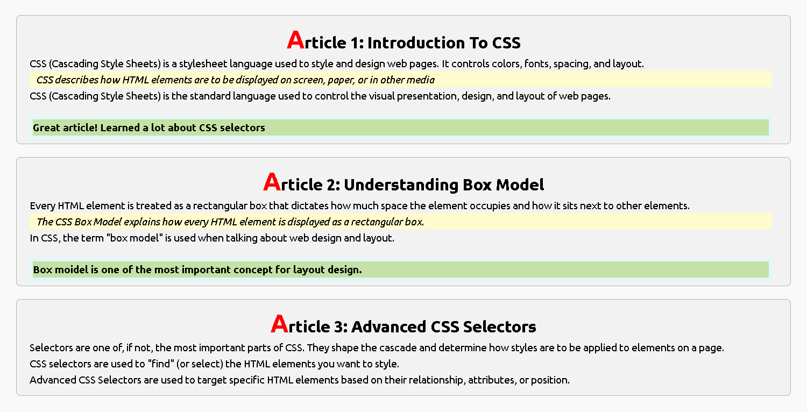

# CSS Lab Work 11.1

## 📌 Project Overview

This project demonstrates the fundamentals of **CSS styling** using HTML and CSS. It showcases the use of typography, pseudo-elements, pseudo-classes, text selection styling, and basic layout design.

The webpage contains three articles explaining important CSS concepts with different visual styles.

---

## 🚀 Features

- Clean and responsive layout
- Custom Google Font (Ubuntu)
- Styled article cards
- CSS `::selection` pseudo-element
- CSS `::first-letter` pseudo-element
- `:nth-child()` pseudo-class
- Background colors and borders
- Rounded corners
- Proper spacing using margin and padding

---

## 🛠️ Technologies Used

- HTML5
- CSS3
- Google Fonts (Ubuntu)

---

## 📂 Project Structure

```
Labwork-11.1/
│
├── index.html
├── css/
│   └── style.css
└── README.md
```

---

## 📖 Articles Included

### Article 1: Introduction to CSS
- What CSS is
- Purpose of CSS
- Styling HTML elements
- CSS basics

### Article 2: Understanding Box Model
- HTML elements as boxes
- Margin
- Border
- Padding
- Content area

### Article 3: Advanced CSS Selectors
- CSS Selectors
- Targeting HTML elements
- Advanced selector concepts

---

## 🎨 CSS Concepts Demonstrated

### Typography
- Google Ubuntu Font
- Font sizes
- Font styles
- Text alignment

### Pseudo Elements
- `::first-letter`
- `::selection`

### Pseudo Classes
- `:nth-child()`

### Styling
- Background colors
- Borders
- Border radius
- Margin
- Padding
- Line height

---

## 📷 Preview

The webpage displays three styled article sections:

- **Article 1:** Introduction to CSS
- **Article 2:** Understanding Box Model
- **Article 3:** Advanced CSS Selectors

Each article is displayed inside a card with customized CSS styling.

---

## 🎯 Learning Objectives

After completing this project, you will understand:

- HTML page structure
- Linking external CSS
- CSS selectors
- Pseudo-elements
- Pseudo-classes
- Box Model basics
- Text styling
- Layout spacing

---

## 📌 How to Run

1. Download or clone this repository.
2. Open the project folder.
3. Open `index.html` in your web browser.

No additional software or installation is required.

---

## Screenshort



---

## 👨‍💻 Author

**Rajan Kumar Tiwari**

Frontend Developer | Aspiring Full Stack Developer

GitHub: https://github.com/rajan9430

---

## 📄 License

This project is created for educational and learning purposes.