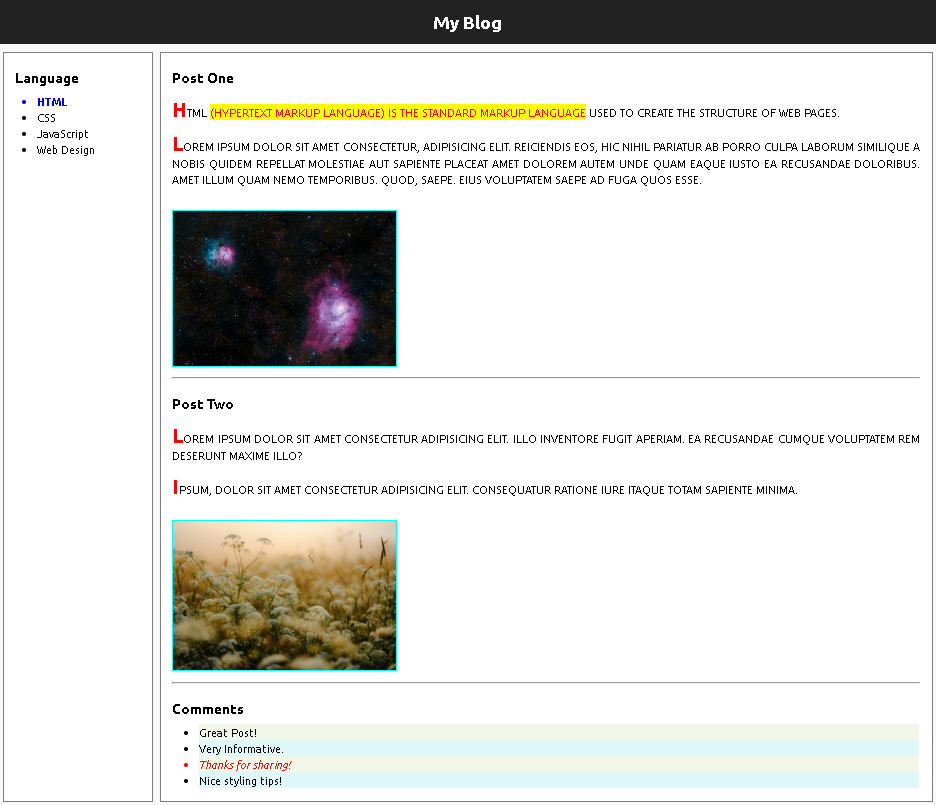

# 📝 My Blog - Labwork 11.2

A simple and responsive **Blog Layout** created using **HTML5** and **CSS3**. This project demonstrates the use of semantic HTML elements, CSS styling, typography, pseudo-elements, and layout techniques.

---

## 📌 Features

- Semantic HTML5 structure
- Clean blog layout
- Left sidebar navigation
- Blog post section
- Styled comments section
- Google Fonts (Ubuntu)
- Text formatting with `mark`
- CSS pseudo-elements (`::selection`, `::first-letter`)
- Text transformation and alignment
- Image styling with borders
- Custom list item styling using `:nth-child()`

---

## 🛠️ Technologies Used

- HTML5
- CSS3
- Google Fonts (Ubuntu)

---

## 📂 Project Structure

```
Labwork-11.2/
│
├── index.html
├── README.md
├── css/
│   └── style.css
│
└── images/
    ├── img1.jpg
    └── img2.jpg
```

---

## 📖 Page Sections

### Header
- Blog title
- Dark navigation header

### Sidebar
- Programming language list
  - HTML
  - CSS
  - JavaScript
  - Web Design

### Blog Content
- Post One
- Post Two
- Highlighted text using `<mark>`
- Styled first letter
- Images with borders

### Comments
- Great Post!
- Very Informative.
- Thanks for sharing!
- Nice styling tips!

---

## 🎨 CSS Concepts Used

- Box Model
- Float Layout
- Typography
- Background Colors
- Borders
- Margins & Padding
- Text Transform
- Text Alignment
- Line Height
- Pseudo Elements
  - `::selection`
  - `::first-letter`
- Pseudo Class
  - `:nth-child()`

---

## 🚀 How to Run

1. Download or clone the repository.
2. Open the project folder.
3. Double-click **index.html**
   or
4. Open it using **Live Server** in Visual Studio Code.

---

## 📸 Preview

The webpage contains:

- Dark Header
- Left Navigation Menu
- Blog Posts
- Styled Images
- Comments Section

---

## 🎯 Learning Objectives

This project helps in understanding:

- HTML5 semantic tags
- CSS layout using float
- Google Fonts integration
- Text formatting
- CSS pseudo-elements
- List styling
- Basic webpage design

---

## Screenshort



---

## 👨‍💻 Author

**Rajan Kumar Tiwari**

Frontend Developer | Learning Full Stack Development

GitHub: https://github.com/rajan9430

---

## 📄 License

This project is created for educational and practice purposes.